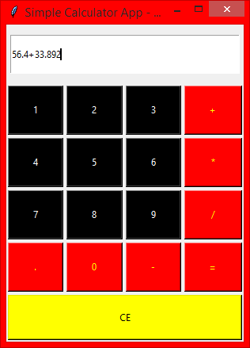

### CALCULATOR 1 - Tkinter
---

This is a basic arithmetic calculator created completely using the module *tkinter*. The version of this calculator employs the use of loops and functions in its codes.
You can view the code [here](calculator_app.py).
You can also explore the basic calculators here
* [Calculator 2](../Basic%20Calculator%202/)
