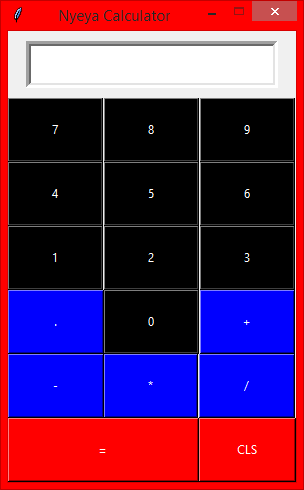

### CALCULATOR 2 - Tkinter App
---
This is another basic arithmetic calculator app in python *tkinter*. The [code to this calculator](calculator.py) uses the concept of classes for the app, and also uses the grid display manager for the widgets positioning.
You can view the code [here](calculator.py).

