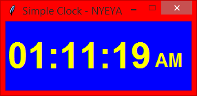

## DIGITAL CLOCK
This is a simple digital clock that calculates the time using your system clock.

It has a very simple interface and design, and can be modified to suit
your personal needs.

Source Code: [digital clock](Simple%20Clock.py)
