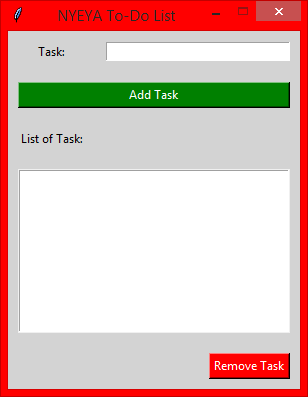

### Todo App in tkinter
You don't actually need a pocket diary or jotter
You can write down stuffs and tasks you need to do
for the day with [this todo app](todo.py), so that you don't forget them

This is a simple tkinter project for beginners and intermediates to
practice with. Any corrections/concerns are very much welcomed.

[
